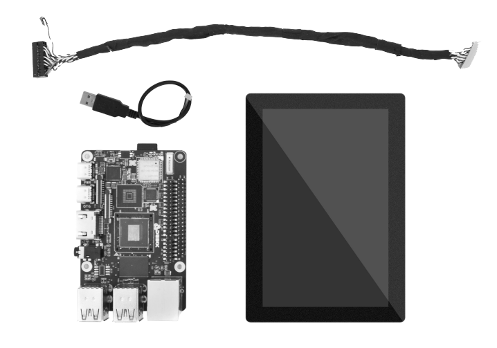

# DEBIX TD050A
 

## Overview
DEBIX TD050A LCD monitor comes with a 800 x 480 display which has the size of 5.0". With LVDS display interface and USB touch interface, it is composed of a color TFT-LCD panel, driver IC, FPC and a backlight unit. The driver element is a-Si TFT active matrix.

## Main Features:
- 5.0" 800*480 display size
- IPS with Normally Black display mode
- LVDS Interface
- RGB-stripe colour arrangement

## Compatibility:
Compatible with all DEBIX series

## Certificates:
RoHS

## Specification:
| DEBIX TD050A |  |
|:--------------|--|
| LCD Size     | 5 inch (Diagonal) |
| Driver Element | a-Si TFT action matrix |
| Resolution   | 800 x 480 |
| Display Mode | IPS with Normally Black |
| Active Area  | 108.00mm x 64.80mm |
| Outline Dimension | 120.80mm x 75.95mm x 2.80mm |
| Colour Arrangement | RGB-stripe |
| LVDS Interface | 1 x LVDS with 20Pin header connector |
| Touch Interface | 1 x USB with 4Pin header connector |
| Luminance | 300 cd/m2 (Typ.) |
| Operating Temp. | -20℃~70℃ |
| Storage Temp. | -30℃~80℃ |
| Input Voltage | DC 5V |
| Net Weight  | 96g (±0.5g) |
| Gross Weight | 228g (±0.5g) |

 

## Contact Us
- **Headquarters**: DEBIX Technology Inc., 8345 Gold River Ct., Las Vegas, NV 89113, USA  
- **Factory**: 5-6/F., East Zone, Shunheda A2 Building, Liqxiandong Industrial Park, XiLi, Nanshan Dist., Shenzhen, China  
- **Email**: info@debix.io  
- **Website**: [www.debix.io](https://www.debix.io)  
- **Community**: [Discord](https://discord.com/invite/adaHHaDkH2)